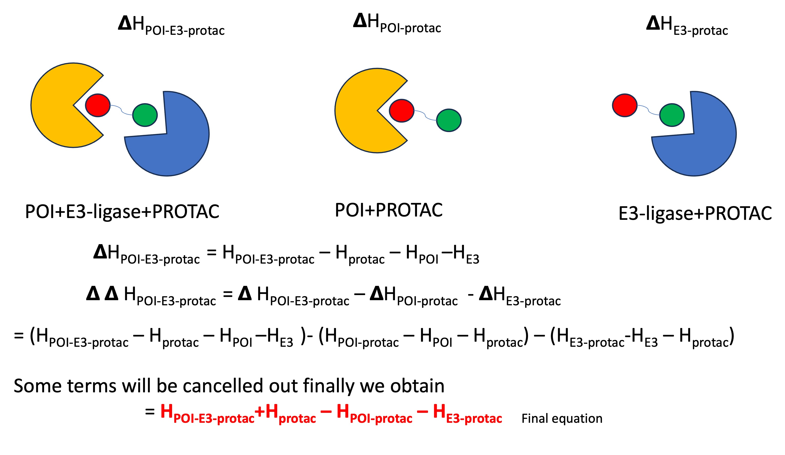

# PROTAC MM/GBSA SCORING TUTORIAL USING AMBER (MD) PACKAGE

Introduction to PROTACs and Computational Challenges

PROTACs (PROteolysis Targeting Chimeras) are bifunctional molecules that link a Protein of Interest (POI) to an E3 ligase, promoting the degradation of the POI via the proteasomal pathway. One of the key challenges in early-stage drug design is predicting the efficiency of a PROTAC in degrading a POI before experimental validation.

Computational methods, such as MM/GBSA (Molecular Mechanics/Generalized Born Surface Area), are commonly used to assess the favorability of forming the ternary complex (POI-PROTAC-E3 ligase). While more rigorous methods like Free Energy Perturbation (FEP) and Thermodynamic Integration (TI) exist, they are computationally intensive and may not always be practical for early-stage screening.

Understanding the Need for Energetic Decoupling

Calculating the overall ternary binding energy alone may not be sufficient. This is because PROTAC substructures can independently bind with high affinity to either the POI or the E3 ligase. Therefore, it is necessary to decouple these energetic contributions to derive a cooperativity score, 
ΔΔH, which reflects how the subunits synergize in forming the ternary complex.

Challenge in Obtaining Cooperativity Scores from MM/GBSA

Despite the importance of calculating cooperativity, it can be difficult to find clear guidance in the literature on how to derive this score from MM/GBSA calculations. To address this gap, I have created a notebook that walks users through the process of calculating these scores.

li AMBERTOOLS li

li CHIMERA li

li AMBER20 or above li

Alert: MM/GBSA only provides qualtitative information about protein-ligand system most of the times they do not correlate well with the affinities calculated well with the experimentally calculated affinities. 




## Preparation of protein and ligand


```python
#Here I am using an example PDB file which contains BRD4(POI) and CRBN (ligase) with PROTAC
import os
import sys
import re

# Open output files for writing
with open('PROTAC.pdb', 'w') as f, open('POI-E3.pdb', 'w') as p, open("example.pdb", "r") as file:
    lines = file.readlines()
    
    # First pass to extract "UNL" and "CONECT" for ligand.pdb, and "ATOM B" for 2proteinsWithH.pdb
    for index, line in enumerate(lines):
        if "LIG" in line or "CONECT" in line:
            print(line.strip(), file=f)
        if "ATOM" in line and " B " in line:
            print(line.strip(), file=p)
    
    # Second pass to extract "ATOM A" for 2proteinsWithH.pdb
    for index, line in enumerate(lines):
        if "ATOM" in line and " A " in line:
            print(line.strip(), file=p)
```


```python
#Running PROTAC thorugh antechamber to have unique atom names for chimera
!antechamber -i PROTAC.pdb -fi pdb -o PROTAC_chimera_compatible.pdb -fo pdb 
```

    
    Welcome to antechamber 22.0: molecular input file processor.
    
    Info: acdoctor mode is on: check and diagnose problems in the input file.
    Info: The atom type is set to gaff; the options available to the -at flag are
          gaff, gaff2, amber, bcc, and sybyl.
    
    -- Check Format for pdb File --
       Status: pass
    -- Check Unusual Elements --
       Status: pass
    -- Check Open Valences --
       Status: pass
    -- Check Geometry --
          for those bonded   
          for those not bonded   
       Status: pass
    -- Check Weird Bonds --
       Status: pass
    -- Check Number of Units --
       Status: pass
    acdoctor mode has completed checking the input file.
    
    


```bash
%%bash
cat >add_hydrogens.com <<EOF
setattr a idatmType C3 :LIG@C,C2,C3,C4,C5,C6,C7,C8,C9
setattr a idatmType Npl :LIG@N1,N
sel H
del sel
addh
write #0 protac_ch.pdb
#sel H
#del sel
#write #0 poi-e3_ch.pdb
EOF
```


```python
import subprocess

# Path to your Chimera executable
chimera_path = "/Applications/Chimera.app/Contents/MacOS/chimera"

# Specify the PDB files and the command script
#pdb_file1 = "POI-E3.pdb"
pdb_file2 = "PROTAC_chimera_compatible.pdb"
command_script = "add_hydrogens.com"

# Run Chimera in nogui mode with the specified files and command script
try:
    result = subprocess.run([chimera_path, "--nogui", pdb_file2, command_script], check=True)
    print("Chimera script executed successfully.")
except subprocess.CalledProcessError as e:
    print(f"An error occurred: {e}")
```

    Opening PROTAC_chimera_compatible.pdb...
    Opened PROTAC_chimera_compatible.pdb containing 1 model, 59 atoms, and 1 residues
    Chain-initial residues that are actual N terminii: 
    
    Chain-initial residues that are not actual N terminii: 
    
    Chain-final residues that are actual C terminii: 
    
    Chain-final residues that are not actual C terminii: 
    
    Categorizing heavy atoms
    Building search tree of atom positions
    Adding simple fixed hydrogens
    Adding co-planar hydrogens
    Finding hydrogen bonds
    Finding acceptors in model 'PROTAC_chimera_compatible.pdb'
    Building search tree of acceptor atoms
    Finding donors in model 'PROTAC_chimera_compatible.pdb'
    Matching donors in model 'PROTAC_chimera_compatible.pdb' to acceptors
    0 hydrogen bonds
    
    Sorting hydrogen bonds by distance
    Organizing h-bond info
    Adding hydrogens by h-bond strength
    Adding hydrogens to primary aromatic amines
    Using steric criteria to resolve partial h-bonders
    Adding hydrogens to non-h-bonding atoms
    Deciding aromatic nitrogen protonation
    Hydrogens added
    Hydrogens added
    
    Wrote protac_ch.pdb into /Users/lokesh/PROTAC_MMGBSA
    Chimera script executed successfully.


    Registration file "/Users/lokesh/.chimera/registration" has expired.
    
    You have used an unregistered copy of Chimera for 17 days.
    You can either register now by visiting:
       http://www.cgl.ucsf.edu/cgi-bin/chimera_registration.py
    or by choosing 'Registration...' from the 'Help' menu next
    time you start Chimera with the gui enabled.
    
    Registration is free.  By providing the information requested
    you will be helping us document the impact this software is
    having in the scientific community. The information you supply
    will only be used for reporting summary statistics to NIH.


## Adding charges and prepare ligand for Amber force-field parameters


```bash
%%bash
#antechamber -i protac_ch.pdb -fi pdb -o protac_gaff2.mol2 -fo mol2 -c bcc -nc 0 -at gaff2 

#rm *.AC *.INF *.AC0 sqm.pdb sqm.in sqm.out
#parmchk2 -i protac_gaff2.mol2 -f mol2 -s 2 -o protac.frcmod

```


## Generating topology for AMBER minimization 


```bash
%%bash
cat > tleap_prep.in <<EOF
source leaprc.protein.ff19SB
source leaprc.gaff2

loadamberparams protac.frcmod
source leaprc.water.opc
loadamberparams frcmod.ionslm_126_opc

set default PBradii mbondi2

rec=loadpdb poi-e3_ch.pdb

###Load Ligand frcmod/prep


lig=loadmol2 protac_gaff2.mol2

gascomplex= combine {rec lig}

savepdb gascomplex complex.gas.pdb
saveamberparm gascomplex complex.gas.prmtop complex.gas.rst7

solvcomplex= combine {rec lig}
solvateoct solvcomplex OPCBOX 10.0

###Neutralize system (it will add either Na or Cl depending on net charge)
addions solvcomplex Cl- 0
addions solvcomplex Na+ 0

###Write solvated pdb file
savepdb solvcomplex complex.opc.pdb

charge solvcomplex

###Write Solvated topology and coord file
saveamberparm solvcomplex complex.opc.prmtop complex.opc.rst7

quit

EOF

```


```bash
%%bash
tleap -f tleap_prep.in
```

    -I: Adding /Users/lokesh/miniconda3/dat/leap/prep to search path.
    -I: Adding /Users/lokesh/miniconda3/dat/leap/lib to search path.
    -I: Adding /Users/lokesh/miniconda3/dat/leap/parm to search path.
    -I: Adding /Users/lokesh/miniconda3/dat/leap/cmd to search path.
    -f: Source tleap_prep.in.
    
    Welcome to LEaP!
    (no leaprc in search path)
    Sourcing: ./tleap_prep.in
    ----- Source: /Users/lokesh/miniconda3/dat/leap/cmd/leaprc.protein.ff19SB
    ----- Source of /Users/lokesh/miniconda3/dat/leap/cmd/leaprc.protein.ff19SB done
    Log file: ./leap.log
    Loading parameters: /Users/lokesh/miniconda3/dat/leap/parm/parm19.dat
    Reading title:
    PARM99 + frcmod.ff99SB + frcmod.parmbsc0 + OL3 for RNA + ff19SB
    Loading parameters: /Users/lokesh/miniconda3/dat/leap/parm/frcmod.ff19SB
    Reading force field modification type file (frcmod)
    Reading title:
    ff19SB AA-specific backbone CMAPs for protein 07/25/2019
    Loading library: /Users/lokesh/miniconda3/dat/leap/lib/amino19.lib
    Loading library: /Users/lokesh/miniconda3/dat/leap/lib/aminoct12.lib
    Loading library: /Users/lokesh/miniconda3/dat/leap/lib/aminont12.lib
    ----- Source: /Users/lokesh/miniconda3/dat/leap/cmd/leaprc.gaff2
    ----- Source of /Users/lokesh/miniconda3/dat/leap/cmd/leaprc.gaff2 done
    Log file: ./leap.log
    Loading parameters: /Users/lokesh/miniconda3/dat/leap/parm/gaff2.dat
    Reading title:
    AMBER General Force Field for organic molecules (Version 2.2.20, March 2021)
    Loading parameters: ./protac.frcmod
    Reading force field modification type file (frcmod)
    Reading title:
    Remark line goes here
    ----- Source: /Users/lokesh/miniconda3/dat/leap/cmd/leaprc.water.opc
    ----- Source of /Users/lokesh/miniconda3/dat/leap/cmd/leaprc.water.opc done
    Loading library: /Users/lokesh/miniconda3/dat/leap/lib/atomic_ions.lib
    Loading library: /Users/lokesh/miniconda3/dat/leap/lib/solvents.lib
    Loading parameters: /Users/lokesh/miniconda3/dat/leap/parm/frcmod.opc
    Reading force field modification type file (frcmod)
    Reading title:
    Parameters for OPC water (JPCL, 2014, 5 (21), pp 3863-3871)
    Loading parameters: /Users/lokesh/miniconda3/dat/leap/parm/frcmod.ionslm_126_opc
    Reading force field modification type file (frcmod)
    Reading title:
    Li/Merz ion parameters of atomic ions for the OPC water model (12-6 set)
    Loading parameters: /Users/lokesh/miniconda3/dat/leap/parm/frcmod.ionslm_126_opc
    Reading force field modification type file (frcmod)
    Reading title:
    Li/Merz ion parameters of atomic ions for the OPC water model (12-6 set)
    Using H(N)-modified Bondi radii
    Loading PDB file: ./poi-e3_ch.pdb
      total atoms in file: 4160
      Leap added 4154 missing atoms according to residue templates:
           4154 H / lone pairs
    Loading Mol2 file: ./protac_gaff2.mol2
    Reading MOLECULE named LIG
    Writing pdb file: complex.gas.pdb
    
    /Users/lokesh/miniconda3/bin/teLeap: Warning!
     Converting N-terminal residue name to PDB format: NSER -> SER
    
    /Users/lokesh/miniconda3/bin/teLeap: Warning!
     Converting C-terminal residue name to PDB format: CGLU -> GLU
    
    /Users/lokesh/miniconda3/bin/teLeap: Warning!
     Converting N-terminal residue name to PDB format: NPRO -> PRO
    
    /Users/lokesh/miniconda3/bin/teLeap: Warning!
     Converting C-terminal residue name to PDB format: CPRO -> PRO
    Checking Unit.
    
    /Users/lokesh/miniconda3/bin/teLeap: Warning!
    The unperturbed charge of the unit (2.996000) is not zero.
    
    /Users/lokesh/miniconda3/bin/teLeap: Note.
    Ignoring the warning from Unit Checking.
    
    Building topology.
    Building atom parameters.
    Building bond parameters.
    Building angle parameters.
    Building proper torsion parameters.
    Building improper torsion parameters.
     total 1695 improper torsions applied
    Building H-Bond parameters.
    Incorporating Non-Bonded adjustments.
    Not Marking per-residue atom chain types.
    Marking per-residue atom chain types.
      (Residues lacking connect0/connect1 - 
       these don't have chain types marked:
    
    	res	total affected
    
    	CGLU	1
    	CPRO	1
    	LIG	1
    	NPRO	1
    	NSER	1
      )
     (no restraints)
    Scaling up box by a factor of 1.164724 to meet diagonal cut criterion
      Solute vdw bounding box:              52.911 62.479 107.004
      Total bounding box for atom centers:  130.298 130.298 130.298
          (box expansion for 'iso' is 159.7%)
      Solvent unit box:                     18.865 18.478 19.006
      Volume: 1131741.527 A^3 (oct)
      Total mass 625155.978 amu,  Density 0.917 g/cc
      Added 31366 residues.
    3 Cl- ions required to neutralize.
    Adding 3 counter ions to "solvcomplex" using 1A grid
    Grid extends from solute vdw + 2.36  to  8.34
    Resolution:      1.00 Angstrom.
    Solvent present: replacing closest with ion
    	 when steric overlaps occur
    Calculating grid charges
    (Replacing solvent molecule)
    Placed Cl- in solvcomplex at (22.28, 43.56, -2.37).
    (Replacing solvent molecule)
    Placed Cl- in solvcomplex at (27.96, 40.57, 0.67).
    (Replacing solvent molecule)
    Placed Cl- in solvcomplex at (-33.70, -1.17, 7.51).
    
    Done adding ions.
     0.004000 0 1 0
    0 Na+ ion required to neutralize.
    Adding 0 counter ions to "solvcomplex" using 1A grid
    Writing pdb file: complex.opc.pdb
       printing CRYST1 record to PDB file with box info
    
    /Users/lokesh/miniconda3/bin/teLeap: Warning!
     Converting N-terminal residue name to PDB format: NSER -> SER
    
    /Users/lokesh/miniconda3/bin/teLeap: Warning!
     Converting C-terminal residue name to PDB format: CGLU -> GLU
    
    /Users/lokesh/miniconda3/bin/teLeap: Warning!
     Converting N-terminal residue name to PDB format: NPRO -> PRO
    
    /Users/lokesh/miniconda3/bin/teLeap: Warning!
     Converting C-terminal residue name to PDB format: CPRO -> PRO
    Total unperturbed charge:  -0.004000
    Total perturbed charge:    -0.004000
    Checking Unit.
    
    /Users/lokesh/miniconda3/bin/teLeap: Note.
    Ignoring the warnings from Unit Checking.
    
    Building topology.
    Building atom parameters.
    Building bond parameters.
    Building angle parameters.
    Building proper torsion parameters.
    Building improper torsion parameters.
     total 1695 improper torsions applied
    Building H-Bond parameters.
    Incorporating Non-Bonded adjustments.
    Not Marking per-residue atom chain types.
    Marking per-residue atom chain types.
      (Residues lacking connect0/connect1 - 
       these don't have chain types marked:
    
    	res	total affected
    
    	CGLU	1
    	CPRO	1
    	LIG	1
    	NPRO	1
    	NSER	1
      )
     (no restraints)
    	Quit
    
    Exiting LEaP: Errors = 0; Warnings = 9; Notes = 2.


## Preparing prmtops for MMGBSA runs
Before generating files for minimization and MMGBSA runs. I did not perform Hydrogen Mass Repartion which is done for longer time steps (4 fs). For this run, we will be using 2 fs.


```bash
%%bash
cat > gen_prmtop_mmgbsa.temp <<EOF

parm complex.gas.prmtop [1]
parm complex.gas.prmtop [2]
parm complex.gas.prmtop [3]
parm complex.gas.prmtop [4]
parm complex.gas.prmtop [5]
parm complex.gas.prmtop [6]

parmstrip :1-127:512 parm [1]
parmwrite out E3.prmtop parm [1]

parmstrip :1-511 parm [2]
parmwrite out protac.prmtop parm [2]

parmstrip :128-512 parm [3]
parmwrite out POI.prmtop parm [3]

parmstrip :512 parm [4]
parmwrite out POI-E3.prmtop parm [4]

parmstrip :1-127 parm [5]
parmwrite out E3-protac.prmtop parm [5]

parmstrip :128-511 parm [6]
parmwrite out POI-protac.prmtop parm [6]

EOF


```


```bash
%%bash
cpptraj -i gen_prmtop_mmgbsa.temp -o gen_prmtop_mmgbsa.log
```

    Info: Redirecting output to file 'gen_prmtop_mmgbsa.log'


## Final Step: Generating ΔΔH MM/GBSA Numbers

In this final step of the tutorial, we will run the `run_minimization_mmgbsa.sh` script. This script performs system minimization and then calculates the MM/GBSA energies.

The MM/GBSA calculations will generate three output files:

1. **System 1**: Ligand is the PROTAC, and the receptor is POI-E3  
   *Filename: `POI-E3.en`*

2. **System 2**: Ligand is the POI, and the receptor is E3-PROTAC  
   *Filename: `E3Lig.en`*

3. **System 3**: Ligand is the E3, and the receptor is POI-PROTAC  
   *Filename: `POIlig.en`*

We will extract two key numbers from these files as outlined in the introduction. Below are the details for the energy values needed:

- **From `POI-E3.en`**:  
  $$ \( H_{\text{POI-E3-PROTAC}} = -20441.6 \, \text{kcal/mol} \)$$
  $$ \( H_{\text{PROTAC}} = -102.7 \, \text{kcal/mol} \)$$

- **From `POIlig.en`**:  
  $$ \( H_{\text{POI-PROTAC}} = -5373.6 \, \text{kcal/mol} \)$$

- **From `E3Lig.en`**:  
  $$ \( H_{\text{E3-PROTAC}} = -15128.2 \, \text{kcal/mol} \)$$

### Calculation of ΔΔH Score

Using the formula provided earlier:

$$
\Delta\Delta H = H_{\text{POI-E3-PROTAC}} - H_{\text{PROTAC}} - H_{\text{POI-PROTAC}} - H_{\text{E3-PROTAC}}
$$

Substituting the values:

$$
\Delta\Delta H = -20441.6 - 102.7 - (-5373.6) - (-15128.2) = -41.9 \, \text{kcal/mol}
$$

Thus, the **ΔΔH score for this example PDB of the ternary complex is:**

$$
\Delta\Delta H = -41.9 \, \text{kcal/mol}
$$


```python

```
